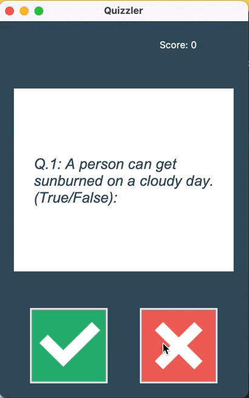

# Quiz App

## Demo

## Description
This is a fun and interactive quiz application that allows users to test their knowledge on a variety of topics.
It has been developed using the Tkinter library for GUI programming and integrates with a trivia API to provide 
different true or false questions for the user to answer. The Quiz app is a great way to challenge yourself and have fun.

### Features
1. User-Friendly Interface: The app provides a clean user interface that makes navigating through the quiz easy for users.
2. True/False Questions: The app presents user with a true and false button, giving them two options to choose from for each question.
3. Trivia API integration: The app fetches 20 questions from a trivia API, ensuring a diverse question bank.
4. Score Tracking, The app keeps track of the user's score as they progress through the quiz.
5. Correct answers: Users receive instant feedback on whether their answers are correct or incorrect. If the user's 
answer is correct the screen turns green, and if the user's answer is wrong, the screen turns red.
6. End-of-Quiz: The app lets you know when you are done answering the entire 20 questions.

### Installation
1. Clone or download this repository to your local machine.
2. Ensure you have Python 3 installed on your system
3. Install the required packages "requests"
4. Run the main.py file

### How to Use
1. Upon running the Quiz App, you'll be presented with a screen.
2. For each question, read the question carefully and select the option you believe is correct by clicking the true or false button.
3. You will receive a feedback on whether your answer was correct or not.
4. Continue answering the questions until you've completed the quiz.
5. You will see your final score on the top of the screen.

